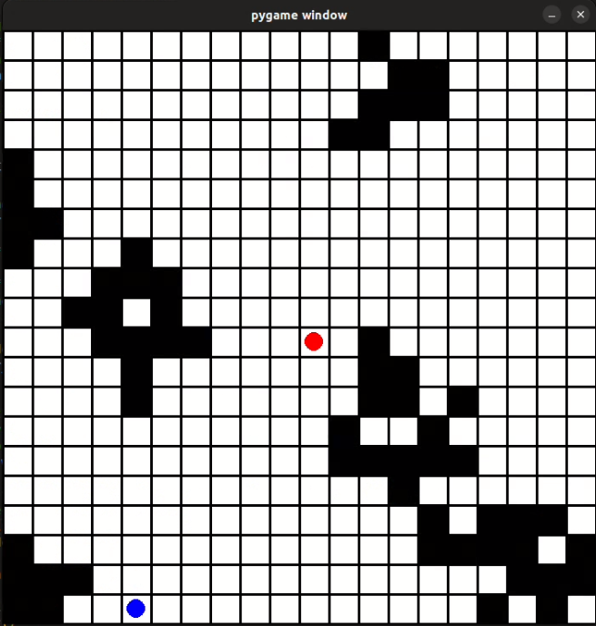

Gwendal Le Mouel

Nicolas Gautier


# AI hide



# Objectives

An agent will learn to hide from a turret using a reinforcement learning algorithm. The agent will use virtual sensors (simulating a real robot) to choose the best action to perform. The final task will be to have an agent that can deal with a previously unseen environment.

# Installation and testing

This program is using stable-baselines3 and python3.7+. To install the package you can use pip by executing this command :
```
pip install stable-baselines3[extra]
```
It will install the package and some other optional packages.


The program can be run by using this command
```
python3 hide.py
```

# Tasks

* Teach an agent to hide in a single environment. V
* Generate procedural environments and create methods to use them.  V
* Create a visual interface to see the robot's behavior and results. V
* Simulate sensors for the robot instead of giving it a position. V
* Teach the robot to hide in an unknown environment. X

# High-level description

The program will create procedural environments with which the agent will interact. The environment consists of a 20x20 grid (adjustable) with some random structures behind which the agent can hide. The turret is in the middle of the grid and the agent will be randomly placed in a position visible by the turret. The environment is shown using pygame. The environment is created with Gym from OpenAI.

The agent uses the PPO (or DQN) reinforcement learning algorithm from [Stable-Baselines3](https://stable-baselines3.readthedocs.io/en/master/index.html) to learn:

* The only action the robot can perform is to move in one of the following directions: left, right, up and down.
* The robot receives the following information from its sensors:
    + the distances of the nearest obstacles up to 10 cases (range distance of the sensors) in 9 directions (left, right, up, left and the 4 diagonals).
    + the direction of the turret (north, northwest, west, ...)
    + its position in the grid  
* The robot will receive a positive reward (proportional to the time needed to hide) when it is hidden from the turret and a negative reward when it tries to perform a forbidden action (moving into a wall for example).


# Results

This algorithm works well in a known environment where it can find the fastest way to hide from the turret. It works much less well when it trains in different environments, it only goes in one direction. The following videos illustrate the results (on same map) :


* 300 000 steps 

[](https://www.youtube.com/watch?v=mGILjY6oc3k)

* 100 000 steps

[](https://www.youtube.com/watch?v=DYT849A3-5M)

# Challenges

* Creation of a procedural environment: One of the objectives was to train the agent in a generated environment. It was necessary to generate complex and realistic environments that were neither too easy nor too difficult to solve. We also had to add methods to get feedback from the map (e.g. raycast to know if the agent is hidden or to simulate sensors).

* The choice of the best parameters: the algorithm and its parameters that best suit the application.  The choice of the virtual sensors that the agent will use, these sensors must be realistic but also useful for the robot. We tried different algorithms, parameters and types of sensors and adapted them step by step to best fit the objectives.

* Generalize on an unknown environment: learning on a single map was not so difficult and gave good results but when we tried to generalize by training on different maps, the agent was not able to hide. We tried using different algorithms and parameters and also changing the sensors of the robot (like giving its position in space) but we did not get good results. Another probable reason is the training time which should be much longer.

# Future work

Try to use other algorithms to process the unknown maps and train the agent in a much more long time.

# Takeaways

* Learn the reinforcement algorithm and its possibilities (not seen in the module).
* Configure and implement a machine learning algorithm: We learned how to configure and adjust the parameters of a machine learning algorithm. We had to create the necessary functions that allow the algorithm to learn in a correct environment.
* Simulation of a robot: We had to choose the best way to represent a robot in a realistic way while giving it enough information to perform its tasks. We had to find the balance.
